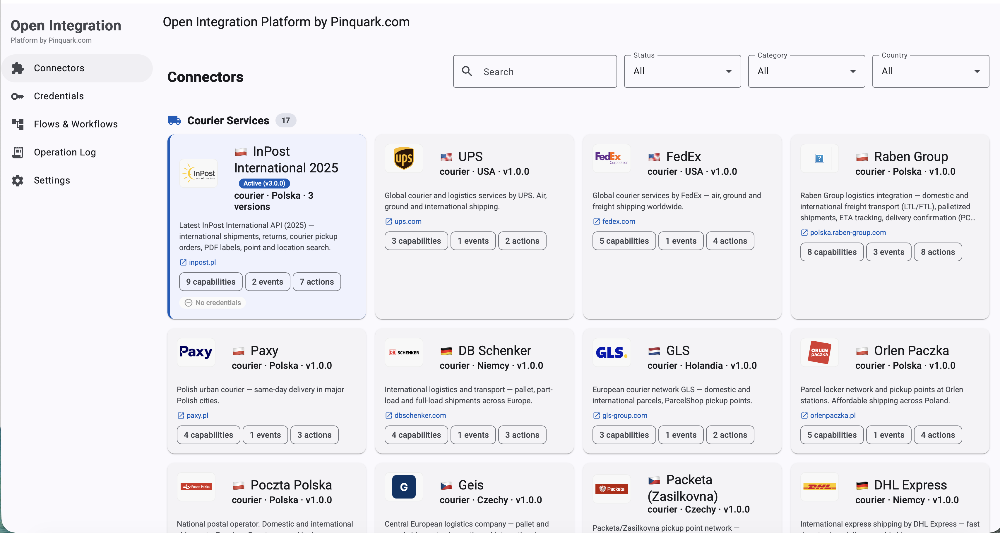
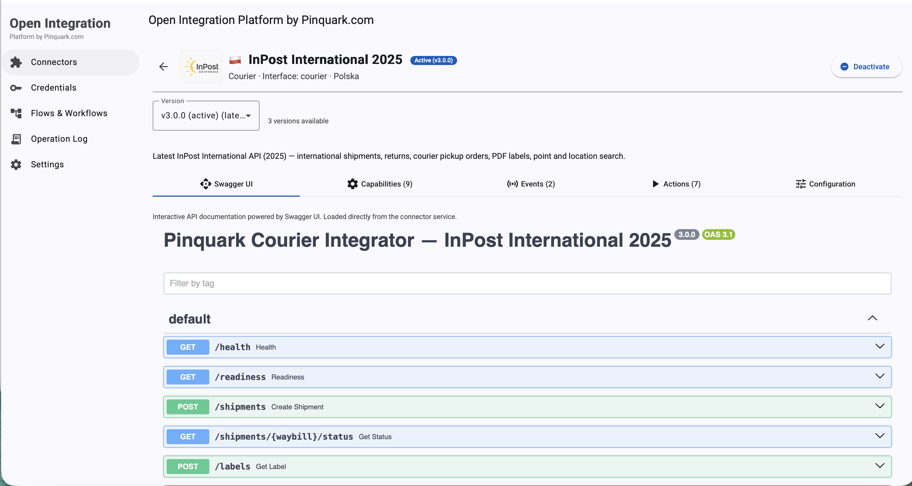
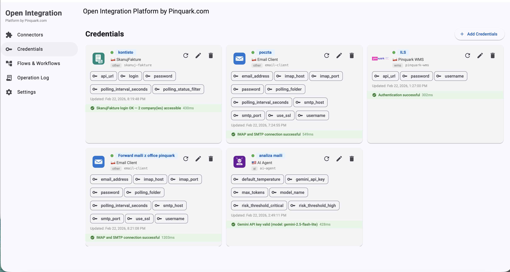
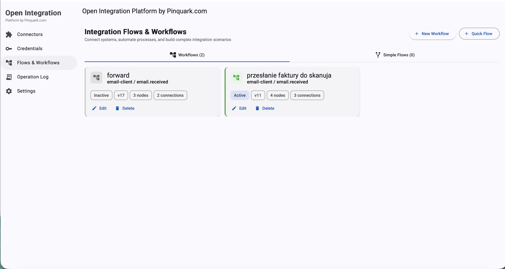
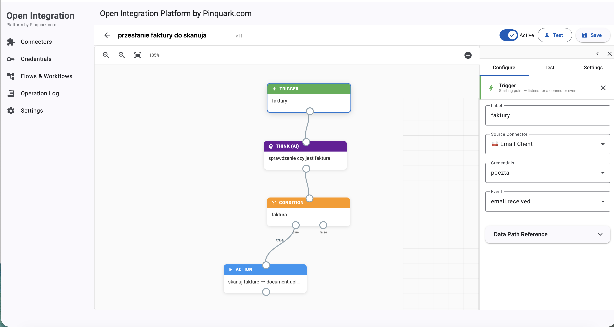
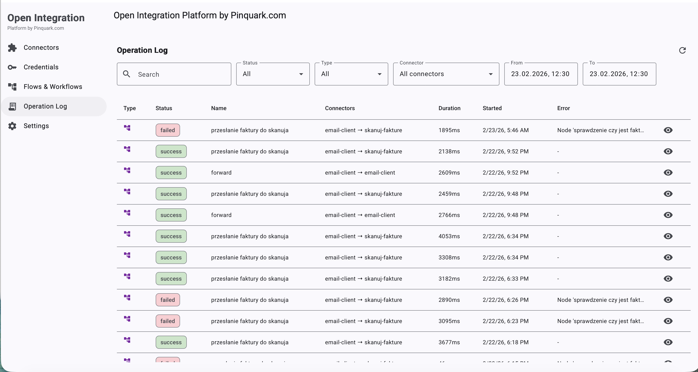
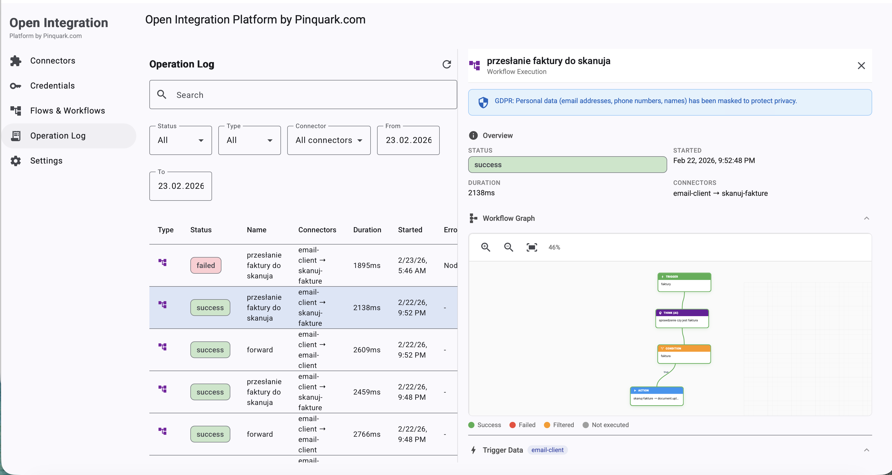

# Open Integration Platform by Pinquark.com

**Open-source integration hub that connects any system with any other system.**

Courier services, e-commerce platforms, ERP systems, WMS, automation — all connected through configurable flows and workflows with a visual dashboard.

[](LICENSE)
[](https://python.org)
[](https://angular.dev)

**[Live Demo](http://46.224.229.166)** — try it instantly, no installation required. Create a workspace, connect your systems, and build flows in minutes.

---

## Why Pinquark?

| Feature | BaseLinker | Pinquark |
|---------|-----------|----------|
| Self-hosted | No | Yes |
| Open-source | No | Yes (Apache 2.0) |
| Any-to-any flows | No (hub-and-spoke) | Yes (Flow Engine) |
| Zero-impact connectors | Closed | Yes (connector.yaml) |
| Embeddable UI | No | Yes (Angular library) |
| API + SDK | REST only | REST + Python/JS SDK |
| Custom connectors | No | Yes |
| On-premise ERP agents | No | Yes (Docker-based) |
| Verification agent | No | Yes (3-tier automated testing) |

## Architecture

```
┌──────────────────────────────────────────────────────────────────┐
│                     Pinquark Platform Core                       │
│                                                                  │
│  ┌──────────┐  ┌─────────────┐  ┌──────────┐  ┌──────────────┐ │
│  │API Gateway│  │ Flow Engine │  │ Workflow │  │  Dashboard   │ │
│  │ (FastAPI) │  │ (any→any)   │  │  Engine  │  │ (Angular)    │ │
│  └────┬─────┘  └──────┬──────┘  └────┬─────┘  └──────────────┘ │
│       │               │              │                           │
│  ┌────┴───────────────┴──────────────┴───────────────────────┐  │
│  │  Connector Registry  │  Credential Vault  │  Mapping       │  │
│  │  (connector.yaml)    │  (AES-256-GCM)     │  Resolver      │  │
│  └───────────────────────────────────────────────────────────┘  │
│                                                                  │
│  ┌──────────────────────────────────────────────────────────┐   │
│  │  Verification Agent (3-tier: health → auth → functional) │   │
│  └──────────────────────────────────────────────────────────┘   │
└──────────────────────────┬───────────────────────────────────────┘
                           │
     ┌─────────────────────┼─────────────────────────┐
     │                     │                         │
┌────┴──────┐    ┌─────────┴─────────┐    ┌──────────┴──────────┐
│  Courier  │    │    E-commerce     │    │  ERP / WMS / Other  │
│  (18)     │    │    (8)            │    │                     │
│ InPost    │    │ Allegro           │    │ Pinquark WMS        │
│ DHL       │    │ Amazon            │    │ InsERT Nexo         │
│ DPD       │    │ Apilo             │    │ AI Agent            │
│ FedEx     │    │ BaseLinker        │    │ SkanujFakture       │
│ GLS       │    │ Shopify           │    │ Email Client        │
│ UPS       │    │ WooCommerce       │    │ FTP/SFTP            │
│ Raben     │    │ Shoper            │    │ Slack               │
│ 11 more…  │    │ IdoSell           │    │ BulkGate SMS        │
└───────────┘    └───────────────────┘    └─────────────────────┘
```

**Every system is an equal peer.** Connectors act as both **source** (emit events) and **destination** (receive actions). The Flow Engine connects any source event to any destination action.

**Zero-impact connector architecture.** Adding a new connector requires only creating a folder with a `connector.yaml` manifest — no platform code changes needed. The platform discovers connectors automatically at startup.

## Screenshots

<table>
  <tr>
    <td><a href="./docs/Screenshots/connectors-list.png"></a></td>
    <td><a href="./docs/Screenshots/connector.png"></a></td>
    <td><a href="./docs/Screenshots/credentials.png"></a></td>
  </tr>
  <tr>
    <td style="text-align:center;">Connectors</td>
    <td style="text-align:center;">Connector Details</td>
    <td style="text-align:center;">Credentials</td>
  </tr>
  <tr>
    <td><a href="./docs/Screenshots/workflow-list.png"></a></td>
    <td><a href="./docs/Screenshots/workflow.png"></a></td>
    <td><a href="./docs/Screenshots/operation-log.png"></a></td>
  </tr>
  <tr>
    <td style="text-align:center;">Flows & Workflows</td>
    <td style="text-align:center;">Workflow Editor</td>
    <td style="text-align:center;">Operation Log</td>
  </tr>
  <tr>
    <td><a href="./docs/Screenshots/operation-log-details.png"></a></td>
    <td></td>
    <td></td>
  </tr>
  <tr>
    <td style="text-align:center;">Execution Details</td>
    <td></td>
    <td></td>
  </tr>
</table>

## Quick Start

### Self-hosted (Docker Compose)

```bash
git clone https://github.com/pinquark/integrations.git
cd integrations
cp .env.example .env
docker compose -f docker-compose.prod.yml up -d
```

Open `http://localhost:3000` for the dashboard.

### Embed in your Angular app

```bash
npm install @pinquark/integrations
```

```typescript
import { PinquarkIntegrationsModule } from '@pinquark/integrations';

@NgModule({
  imports: [
    PinquarkIntegrationsModule.forRoot({
      apiUrl: 'https://api.pinquark.com',
      apiKey: environment.pinquarkApiKey,
    })
  ]
})
export class AppModule {}
```

```html
<pinquark-connector-list [category]="'courier'"></pinquark-connector-list>
<pinquark-credential-form [connectorId]="'inpost'"></pinquark-credential-form>
```

### Use via Python SDK

```bash
pip install pinquark-sdk
```

```python
from pinquark_sdk import PinquarkClient

client = PinquarkClient(api_key="pk_live_xxx")

# Create a shipment via any courier
shipment = await client.courier.create_shipment(
    connector="inpost",
    receiver={"name": "Jan Kowalski", "phone": "+48600100200",
              "address": {"city": "Warszawa", "postal_code": "00-001"}},
    parcels=[{"weight": 2.5, "width": 30, "height": 20, "length": 40}],
)

# Get the label
label_pdf = await client.courier.get_label(shipment.waybill_number)
```

## Flow Engine — connect anything to anything

Define flows that trigger actions across systems automatically:

```yaml
# When an Allegro order arrives, create an InPost shipment
flows:
  - name: "Allegro -> InPost"
    source:
      connector: allegro
      event: order.created
      filter:
        delivery_method: inpost_paczkomat
    destination:
      connector: inpost
      action: shipment.create
    mapping:
      - from: order.buyer.name      -> to: receiver.first_name
      - from: order.buyer.address   -> to: receiver.address
      - from: order.point_id        -> to: extras.target_point
```

Flows and workflows are configured via the dashboard UI or REST API. Default field mappings ship with each connector; tenants can override them per-instance.

## Connectors — 34 and growing

Every connector is a self-contained microservice with its own API, versioning, and documentation. Browse them all in the [dashboard](#screenshots) or via the REST API.

| Category | # | Connectors |
|----------|---|------------|
| **Courier** | 18 | InPost (v1–v3) · DHL · DHL Express · DPD · FedEx · FedEx PL · FX Couriers · GLS · UPS · Poczta Polska · Orlen Paczka · Packeta · Paxy · Raben Group · DB Schenker · Geis · SUUS · SellAsist |
| **E-commerce** | 8 | Allegro · Amazon · Apilo · BaseLinker · Shopify · WooCommerce · Shoper · IdoSell |
| **ERP** | 1 | InsERT Nexo (Subiekt) — hybrid: on-premise agent + cloud connector |
| **WMS** | 1 | Pinquark WMS |
| **AI** | 1 | AI Agent (Gemini) — risk analysis, courier recommendations, data extraction |
| **Other** | 5 | Email Client (IMAP/SMTP) · SkanujFakture (invoice OCR + KSeF) · FTP/SFTP · Slack · BulkGate SMS |

> **Coming soon:** PrestaShop, WAPRO, Comarch ERP, SAP, enova365, and more.
>
> See [docs/CONNECTORS.md](docs/CONNECTORS.md) for full configuration reference.

## Zero-impact connector architecture

Adding a new connector requires **zero changes** to the platform core. Each connector is fully defined by its `connector.yaml` manifest:

```yaml
name: my-connector
category: ecommerce
version: 1.0.0
display_name: "My Connector"
service_name: connector-my-connector

action_routes:
  order.list:
    method: GET
    path: /orders
    query_from_payload: [account_name, page, page_size]

credential_validation:
  required_fields: [api_key]
  test_request:
    method: GET
    url_template: "{api_url}/ping"
    headers_template:
      Authorization: "Bearer {api_key}"
    success_status: 200
```

The platform reads `connector.yaml` at startup for action routing, credential provisioning, credential validation, and verification agent test discovery. No platform files (`gateway.py`, `action_dispatcher.py`, `discovery.py`) need modification.

See [AGENTS.md](AGENTS.md) section 2.1.1 for the full connector.yaml field reference.

## On-premise agents

For ERP systems that run behind firewalls (InsERT Nexo, WAPRO, SAP), the platform provides a Docker-based on-premise agent:

```
┌──────────────────────────┐
│    Client's Network      │
│                          │
│  ┌─────────┐ ┌────────┐ │         ┌─────────────────┐
│  │Local ERP│◀▶│On-Prem │─│────────▶│ Pinquark Cloud  │
│  │(Nexo)   │ │Agent   │ │  HTTPS  │ Integration Hub  │
│  └─────────┘ └────────┘ │         └─────────────────┘
│                  │       │
│             ┌────┴────┐  │
│             │ SQLite  │  │
│             └─────────┘  │
└──────────────────────────┘
```

- Auto-update, offline resilience (local queue), heartbeat monitoring
- Windows installer wizard for easy client deployment
- Downloadable from the connector's detail page in the dashboard

## Verification agent

A built-in 3-tier verification agent continuously monitors all connectors:

| Tier | Scope | Checks |
|------|-------|--------|
| **1 — Infrastructure** | All connectors | `/health`, `/readiness`, `/docs` |
| **2 — Authentication** | With credentials | Account provisioning, auth status, connection status |
| **3 — Functional** | Per-connector | All endpoints, CRUD cycles, error paths, response times |

Runs on schedule (default: every 7 days), on-demand via API, or from the dashboard.

## Project Structure

```
├── platform/                  # Core platform (API Gateway, Flow & Workflow Engine)
│   ├── api/                   # FastAPI application + credential validator
│   ├── core/                  # Business logic (action dispatcher, connector registry,
│   │                          #   flow engine, workflow engine, mapping resolver)
│   ├── db/                    # PostgreSQL models & migrations
│   ├── verification-agent/    # 3-tier connector verification service
│   └── dashboard/             # Angular workspace
│       ├── projects/
│       │   ├── integrations-lib/   # @pinquark/integrations (npm library)
│       │   └── dashboard-app/      # Standalone dashboard
│       └── angular.json
│
├── integrators/               # All connectors by category
│   ├── courier/               # InPost, DHL, DPD, FedEx, GLS, UPS, Raben, ...
│   ├── ecommerce/             # Allegro, Amazon, Apilo, BaseLinker, Shopify, ...
│   ├── erp/                   # InsERT Nexo (on-premise + cloud)
│   ├── wms/                   # Pinquark WMS
│   ├── ai/                    # AI Agent (Gemini)
│   └── other/                 # Email, SkanujFakture, FTP/SFTP, Slack, BulkGate
│
├── shared/                    # Shared Python library (pinquark-common)
│   └── python/
│       └── pinquark_common/   # Interfaces, schemas, utilities
│
├── sdk/                       # Client SDKs
│   ├── python/                # pinquark-sdk (PyPI)
│   └── javascript/            # @pinquark/sdk (npm)
│
├── onpremise/                 # On-premise agent for local ERP connectivity
│   ├── agent/                 # Docker-based agent (Python.NET + FastAPI)
│   └── installers/            # Windows installer wizard
│
├── docs/                      # Per-connector documentation & architecture
│   ├── ARCHITECTURE.md        # System architecture & scalability
│   ├── CONNECTORS.md          # Connector configuration reference
│   ├── courier/
│   ├── ecommerce/
│   ├── erp/
│   └── other/
│
├── k8s/                       # Kubernetes deployment configs
├── ci/                        # CI/CD pipelines
├── monitoring/                # Prometheus, Grafana configs
├── AGENTS.md                  # Agent guidelines, coding standards, full reference
└── README.md
```

## Tech Stack

- **Backend**: Python 3.12+, FastAPI, SQLAlchemy, Alembic, Pydantic v2
- **Database**: PostgreSQL 16 (RLS for multi-tenant), Redis 7 (cache, rate limiting)
- **Frontend**: Angular 18+, Angular Material, TypeScript strict
- **Messaging**: Kafka / Redis Streams (event bus)
- **Connectors**: FastAPI microservices, httpx (async HTTP), zeep (SOAP)
- **On-premise**: Python.NET (pythonnet) for .NET SDK bridges, SQLite for local queuing
- **Infrastructure**: Docker, Kubernetes, Helm, Prometheus, Grafana
- **Security**: AES-256-GCM credential encryption, TLS 1.2+, non-root containers

## Documentation

| Document | Path | Description |
|----------|------|-------------|
| Architecture | [docs/ARCHITECTURE.md](docs/ARCHITECTURE.md) | System architecture, scalability, deployment |
| Connectors | [docs/CONNECTORS.md](docs/CONNECTORS.md) | Configuration reference for all connectors |
| Agent Guidelines | [AGENTS.md](AGENTS.md) | Coding standards, CI/CD, security, interfaces |

## Contributing

See [CONTRIBUTING.md](CONTRIBUTING.md) for development setup, coding standards, and how to create new connectors.

## License

Apache License 2.0 — see [LICENSE](LICENSE) for details.
